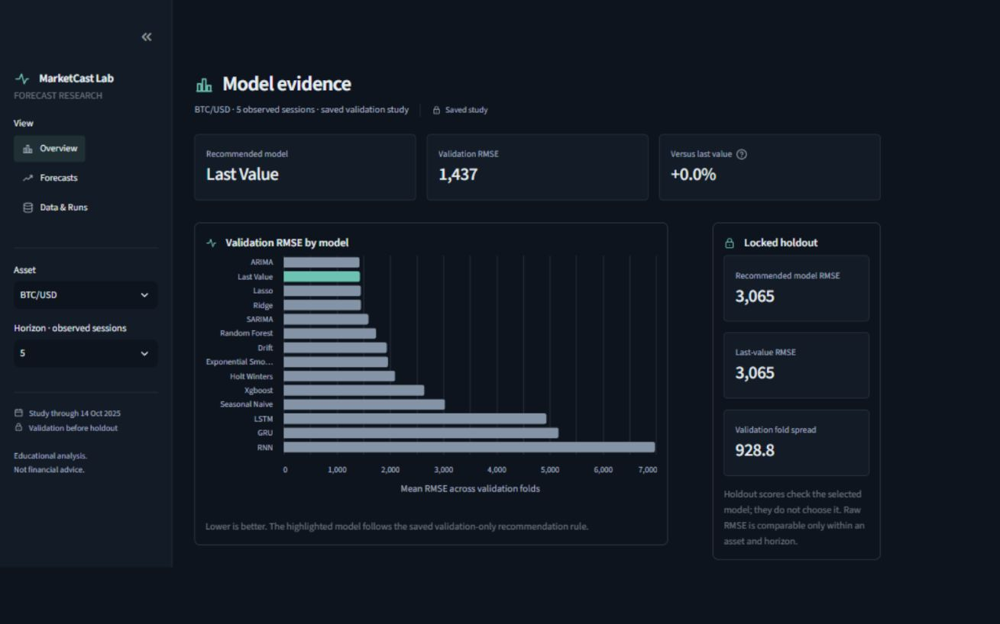

# MarketCast Lab

MarketCast Lab compares daily forecasts across BTC/USD, SPY, EUR/USD and WTI Cushing spot oil. It evaluates 14 model families at horizons of 1, 5 and 20 observed sessions, using three expanding validation folds and a locked holdout. The Streamlit dashboard displays saved experiment results; it does not train models while rendering.

This educational project is dormant and is not actively maintained. The historical study ends on **2025-10-14**. The public GitHub repository is archived and read-only. This README consolidates the project guide, scientific report, presentation findings and preservation documentation.

## Run the dashboard

From PowerShell:

```powershell
Set-Location 'C:\Users\binha\Projects\marketcast-lab'
.\.venv\Scripts\python.exe -m streamlit run src/streamlit.py
```

Open the local URL printed by Streamlit, normally `http://localhost:8501`. Stop the server with Ctrl+C. Running `src/streamlit.py` directly with Python does not start a Streamlit server.

The dashboard has three views: **Overview** compares models, **Forecasts** separates historical backtests from future scenarios, and **Data & Runs** shows source history and experiment details. Asset and horizon controls appear in the sidebar when comparison data is available.

The saved comparison, recommendations and future scenarios are included so the dashboard opens immediately without training or downloading data. Full historical runs are optional: Forecasts and Data & Runs explain when their detailed files are unavailable. If the required comparison files are removed, restore them from the `dormancy-2026-10-03` tag or generate a new study using the commands below.



The desktop view places model comparisons and holdout scores side by side. Panels stack on smaller screens, and the sidebar collapses automatically on phones. Icons are SVG artwork; the interface uses no emojis. The screenshot shows a landscape desktop viewport.

## Install or restore the environment

Python 3.11 through 3.13 is supported. The preservation environment was Windows 11 x64, Python **3.13.15**, and CPU PyTorch **2.14.0+cpu**, with CUDA unavailable. `requirements.txt` pins all 73 validated dependencies and installs the local project with its development, boosting, dashboard and presentation extras.

For the tested environment, run these commands from the repository root:

```powershell
python -m venv .venv
.venv\Scripts\python.exe -m pip install -r requirements.txt
.venv\Scripts\python.exe -m pip check
```

Keep the existing `.venv` when it works; virtual environments are not portable. Installation requires an available package index or wheel cache. No wheel archive was created, and other operating systems are unverified.

## Generate and audit results

The CLI is `main.py` or the installed `marketcast` command. `python main.py --help` lists all commands. The retired `train` and `ui` commands are no longer supported.

To generate a new market study, reports, presentation and future scenarios:

```powershell
.venv\Scripts\python.exe main.py four-markets --config configs/four_asset_full.json
.venv\Scripts\python.exe main.py audit-four-markets
.venv\Scripts\python.exe main.py build-deliverables
.venv\Scripts\python.exe main.py build-future-scenarios
.venv\Scripts\python.exe -m streamlit run src/streamlit.py
```

The first market study downloads Yahoo SPY, ECB EUR/USD and EIA WTI data into ignored `data/raw/`; BTC comes from the bundled CSV. New source revisions and numerical environments can change results. These commands generate a new study rather than recover the historical predictions. Report/scenario commands write their default artifact directories.

For an offline synthetic demonstration:

```powershell
.venv\Scripts\python.exe main.py offline-fixture --output assets/offline-fixture
.venv\Scripts\python.exe main.py audit-four-markets --output assets/offline-fixture
.venv\Scripts\python.exe main.py build-deliverables --index assets/offline-fixture --output assets/offline-phase4
$env:MARKETCAST_ARTIFACT_ROOT = 'assets/offline-fixture'
$env:MARKETCAST_PHASE4_ROOT = 'assets/offline-phase4'
.venv\Scripts\python.exe -m streamlit run src/streamlit.py
```

Synthetic results are software checks, not market evidence. Remove those environment overrides before using the default market study. The fixture generator also writes `data/fixtures/generated/`; to isolate every generated file, run it from a separate scratch working directory using absolute script/config/catalog/output paths and set `PYTHONPATH` to the repository's `src`.

The network-free BTC smoke configuration is `configs/smoke.json`. Before running it for preservation checks, copy it to a temporary directory and set `artifacts_dir` to a separate absolute scratch path and `data_path` to the bundled CSV. Run `main.py experiment --config <scratch-config>`.

For ETH, QQQ, EUR/JPY, Henry Hub gas and the US ten-year Treasury yield, pass `--assets configs/assets_extended.json` to `four-markets` or `offline-fixture` and choose a separate output directory.

## Study design

The research question is how statistical, lag-based machine-learning and recurrent neural forecasts compare across asset classes and horizons. A horizon counts observed dates, so equal horizons span different calendar periods. Holidays and weekends are not inserted. Recursive forecasts feed previous predictions into later steps.

The study uses the final 180 observations per asset through 2025-10-14, three expanding 20-observation validation windows and a locked 20-observation holdout. Models share target dates within each asset. The holdout checks selections made on validation; it never selects or tunes models.

The 14 families are last value, drift, seasonal naive, exponential smoothing, Holt-Winters, ARIMA, SARIMA, Ridge, Lasso, Random Forest, XGBoost, RNN, LSTM and GRU. Ridge/Lasso scale training lags inside a pipeline; trees use unscaled lag windows. The saved recurrent configurations use a ten-observation window, one recurrent layer, four hidden units and two training epochs. LSTM and GRU add gates to the basic recurrent structure. Statistical orders are fixed, and early stopping is available. This is a bounded experiment rather than a broad architecture search.

A non-baseline recommendation requires at least 5% improvement over last value in both validation mean RMSE and mean plus one fold standard deviation.

### Sources and target semantics

| asset | provider | target | reuse | source_url |
| --- | --- | --- | --- | --- |
| crypto:BTC-USD | Bundled cryptocurrency statistics CSV; upstream provenance unknown | close | Unknown; do not redistribute beyond existing repository | unknown |
| equity:SPY | Yahoo Finance chart, SPDR S&P 500 ETF Trust | adjusted_close | Personal research only; raw redistribution unverified | https://query1.finance.yahoo.com/v8/finance/chart/SPY?period1=1672531200&period2=1798761600&interval=1d&events=history&includeAdjustedClose=true |
| forex:EUR-USD | ECB euro foreign exchange reference rate | close | Free reuse with ECB citation and transformation disclosure | https://data-api.ecb.europa.eu/service/data/EXR/D.USD.EUR.SP00.A?startPeriod=2023-01-01&endPeriod=2026-12-31&format=csvdata |
| oil:WTI-CUSHING-SPOT | EIA Cushing, OK WTI spot price FOB | close | EIA government data is public domain; redistribution permitted with attribution | https://www.eia.gov/dnav/pet/hist_xls/RWTCd.xls |

BTC models close, SPY models adjusted close, and ECB/EIA observations are reference or spot prices. WTI is a Cushing cash spot assessment, not a continuous futures contract; futures roll discontinuities do not apply. The expanded catalog's providers and units are recorded by run manifests. The rights statements above describe original provenance, not a new license review. No additional raw feeds were uploaded during preservation.

### Data quality and exploratory analysis

| asset | rows | first | last | duplicate keys | invalid OHLC | outlier flags |
| --- | --- | --- | --- | --- | --- | --- |
| crypto:BTC-USD | 3901 | 2015-02-09 | 2025-10-14 | 0 | 0 | 88 |
| equity:SPY | 698 | 2023-01-03 | 2025-10-14 | 0 | 0 | 1 |
| forex:EUR-USD | 712 | 2023-01-02 | 2025-10-14 | 0 | 0 | 0 |
| oil:WTI-CUSHING-SPOT | 693 | 2023-01-03 | 2025-10-14 | 0 | 0 | 0 |

Rows are sorted, duplicate asset/date keys rejected and missing source prices dropped. ECB/EIA OHLC and volume stay null. Source BTC/SPY bars remain unchanged while SPY uses its separate adjusted target. Quality reports record missing values, observed-date gaps, weekday gaps including holidays and close-return outlier flags above 10%.

| asset | ADF p | KPSS p | return std | period |
| --- | --- | --- | --- | --- |
| crypto:BTC-USD | 0.0246 | 0.01 | 0.01639 | 7 |
| equity:SPY | 0.9424 | 0.01 | 0.01423 | 5 |
| forex:EUR-USD | 0.5175 | 0.01 | 0.005502 | 5 |
| oil:WTI-CUSHING-SPOT | 0.02305 | 0.06394 | 0.0212 | 5 |

Trend describes sustained level movement, seasonality recurring patterns, cycles irregular broader swings and noise unexplained variation. Stationarity concerns stability of the distribution over time. EDA examines levels and returns using rolling statistics, decomposition, ACF/PACF, ADF and KPSS. ARIMA uses first differencing; lag and recurrent scalers fit training history only. Forecast evaluation remains in target price units, and features never cross assets. Seven observations form a crypto week; five observations approximate a working week, with holiday gaps limiting that proxy.

### Validation dates

| asset | first validation | last validation | holdout |
| --- | --- | --- | --- |
| crypto:BTC-USD | 2025-07-27 | 2025-09-24 | 2025-09-25 to 2025-10-14 |
| equity:SPY | 2025-06-23 | 2025-09-16 | 2025-09-17 to 2025-10-14 |
| forex:EUR-USD | 2025-06-25 | 2025-09-16 | 2025-09-17 to 2025-10-14 |
| oil:WTI-CUSHING-SPOT | 2025-06-20 | 2025-09-15 | 2025-09-16 to 2025-10-14 |

## Historical results

These values summarize the original saved study; they are not newly generated results. It produced 672 fold/holdout metric rows, zero model failures and one FX maximum-likelihood convergence warning.

| asset_id | horizon | model | rmse_mean | rmse_std | fold_cv | final_test_rmse | last_value_holdout_rmse | holdout_vs_last_value_pct | fit_seconds_mean | inference_seconds_mean | run_id |
| --- | --- | --- | --- | --- | --- | --- | --- | --- | --- | --- | --- |
| crypto:BTC-USD | 1 | holt_winters | 574.9 | 525.7 | 0.9145 | 4323 | 4340 | -0.3888 | 0.07474 | 0.002049 | 20260928T054600014613Z-2646b062 |
| crypto:BTC-USD | 5 | last_value | 1437 | 928.8 | 0.6463 | 3065 | 3065 | 0 | 1.91e-05 | 7.767e-06 | 20260928T054600014613Z-2646b062 |
| crypto:BTC-USD | 20 | xgboost | 3552 | 750.4 | 0.2112 | 7606 | 6102 | 24.65 | 0.2308 | 0.01197 | 20260928T054600014613Z-2646b062 |
| equity:SPY | 1 | last_value | 3.108 | 2.866 | 0.9222 | 0.809 | 0.809 | 0 | 1.257e-05 | 7.467e-06 | 20260928T054602477182Z-e456fc7a |
| equity:SPY | 5 | last_value | 8.424 | 5.391 | 0.64 | 5.173 | 5.173 | 0 | 1.257e-05 | 7.467e-06 | 20260928T054602477182Z-e456fc7a |
| equity:SPY | 20 | last_value | 14.39 | 10.15 | 0.7058 | 8.161 | 8.161 | 0 | 1.257e-05 | 7.467e-06 | 20260928T054602477182Z-e456fc7a |
| forex:EUR-USD | 1 | last_value | 0.002233 | 0.001172 | 0.5247 | 0.003 | 0.003 | 0 | 9.9e-06 | 9.7e-06 | 20260928T054604900545Z-5e05e298 |
| forex:EUR-USD | 5 | last_value | 0.008163 | 0.003825 | 0.4686 | 0.003724 | 0.003724 | 0 | 9.9e-06 | 9.7e-06 | 20260928T054604900545Z-5e05e298 |
| forex:EUR-USD | 20 | last_value | 0.009249 | 0.003616 | 0.391 | 0.01312 | 0.01312 | 0 | 9.9e-06 | 9.7e-06 | 20260928T054604900545Z-5e05e298 |
| oil:WTI-CUSHING-SPOT | 1 | ridge | 0.1917 | 0.1194 | 0.6226 | 0.65 | 1.23 | -47.15 | 0.00264 | 0.01256 | 20260928T054607431058Z-28fa2e2c |
| oil:WTI-CUSHING-SPOT | 5 | xgboost | 1.68 | 1.485 | 0.884 | 1.305 | 0.7741 | 68.54 | 0.01121 | 0.01228 | 20260928T054607431058Z-28fa2e2c |
| oil:WTI-CUSHING-SPOT | 20 | xgboost | 1.969 | 0.4607 | 0.234 | 2.473 | 1.815 | 36.27 | 0.01121 | 0.01228 | 20260928T054607431058Z-28fa2e2c |

MAE averages absolute error, RMSE emphasizes larger error, sMAPE scales by actual and forecast magnitude, and MASE compares with an in-sample naive difference. Validation means and standard deviations cover three folds. Fit/inference times measure compute; AIC/BIC apply to fitted statistical models.

Last value survives the selection rule at all SPY and EUR/USD horizons. BTC selects Holt-Winters at one observation and XGBoost at twenty; oil selects Ridge at one and XGBoost at five/twenty. Three selected complex-model cases lose to last value on holdout: BTC at twenty observations and oil at five/twenty. Fold variability and the short holdout limit ranking confidence.


### Residuals and uncertainty

| asset_id | model | ljung_box_pvalue_mean | parameter_count |
| --- | --- | --- | --- |
| crypto:BTC-USD | holt_winters | 0.006187 | — |
| crypto:BTC-USD | last_value | 9.98e-05 | — |
| crypto:BTC-USD | ridge | 0.0002895 | — |
| crypto:BTC-USD | xgboost | 5.783e-05 | — |
| equity:SPY | holt_winters | 0.09361 | — |
| equity:SPY | last_value | 0.07236 | — |
| equity:SPY | ridge | 0.08863 | — |
| equity:SPY | xgboost | 0.07606 | — |
| forex:EUR-USD | holt_winters | 0.03489 | — |
| forex:EUR-USD | last_value | 0.01999 | — |
| forex:EUR-USD | ridge | 0.02698 | — |
| forex:EUR-USD | xgboost | 0.005109 | — |
| oil:WTI-CUSHING-SPOT | holt_winters | 0.3176 | — |
| oil:WTI-CUSHING-SPOT | last_value | 0.1951 | — |
| oil:WTI-CUSHING-SPOT | ridge | 0.02214 | — |
| oil:WTI-CUSHING-SPOT | xgboost | 0.06729 | — |

ARIMA/SARIMA interval coverage is available for 24 asset/model/horizon combinations in `comparison.csv`; coverage is measured on short fold windows and should not be read as calibrated long-run uncertainty.

| asset_id | horizon | model | interval_coverage_mean | final_test_interval_coverage |
| --- | --- | --- | --- | --- |
| crypto:BTC-USD | 1 | arima | 1 | 0 |
| crypto:BTC-USD | 1 | sarima | 1 | 0 |
| crypto:BTC-USD | 5 | arima | 1 | 0.8 |
| crypto:BTC-USD | 5 | sarima | 1 | 0.8 |
| crypto:BTC-USD | 20 | arima | 1 | 0.95 |
| crypto:BTC-USD | 20 | sarima | 1 | 0.95 |
| equity:SPY | 1 | arima | 1 | 1 |
| equity:SPY | 1 | sarima | 1 | 1 |
| equity:SPY | 5 | arima | 1 | 1 |
| equity:SPY | 5 | sarima | 1 | 1 |
| equity:SPY | 20 | arima | 1 | 1 |
| equity:SPY | 20 | sarima | 1 | 1 |
| forex:EUR-USD | 1 | arima | 1 | 1 |
| forex:EUR-USD | 1 | sarima | 1 | 1 |
| forex:EUR-USD | 5 | arima | 1 | 1 |
| forex:EUR-USD | 5 | sarima | 1 | 1 |
| forex:EUR-USD | 20 | arima | 1 | 1 |
| forex:EUR-USD | 20 | sarima | 1 | 1 |
| oil:WTI-CUSHING-SPOT | 1 | arima | 1 | 1 |
| oil:WTI-CUSHING-SPOT | 1 | sarima | 1 | 1 |
| oil:WTI-CUSHING-SPOT | 5 | arima | 0.7333 | 1 |
| oil:WTI-CUSHING-SPOT | 5 | sarima | 0.7333 | 1 |
| oil:WTI-CUSHING-SPOT | 20 | arima | 0.8833 | 1 |
| oil:WTI-CUSHING-SPOT | 20 | sarima | 0.8833 | 1 |

### Interpretation and limitations

There is no stable universal winner. Models should be assessed by asset and horizon, including fold variation and holdout reversals. Raw RMSE is comparable within an asset, not across different price units. ECB fixing is not a continuous FX close, and Yahoo adjustments and spot assessments can be revised. Non-stationarity and regime changes threaten fitted relationships.

The experiment covers one instrument per class, a recent window and limited tuning. It does not evaluate transaction costs, trading strategies or calibrated predictive uncertainty. Future scenarios start at the historical cutoff and do not invent market dates. This is historical forecasting research, not a trading recommendation.

## Files and traceability

| Path | Purpose |
| --- | --- |
| `src/market_forecast/` | Providers, models, evaluation, experiment/artifact readers and publication code |
| `src/streamlit.py` | Streamlit dashboard |
| `src/tests/` | Unit and integration tests |
| `configs/` | Smoke/full experiment settings and asset catalogs |
| `data/crypto_statistics_data.csv` | Bundled BTC/ETH source |
| `data/raw/` | Ignored local provider caches |
| `images/` | Retained historical comparison figures |
| `assets/phase3/`, `assets/phase4/` | Retained comparison/recommendation and future-scenario snapshots required by the dashboard |
| `assets/runs/` | Optional generated full experiment runs, ignored by Git |
| `requirements.txt` | Exact dependency versions and editable project installation |

Each full run records config, source/provenance gap, raw SHA-256, target semantics, quality, folds, model parameters, predictions, metrics, diagnostics, warnings and model files. Predictions identify asset, model, fold, partition, horizon, step, date, actual and forecast. Parquet falls back to CSV when its engine is unavailable. `fold_metrics.csv` links rows to run IDs, configuration, data manifest and predictions; `run_index.json` identifies the four study runs. Legacy TensorFlow/Prophet outputs are excluded from the audited study.

## Dormancy and recovery

The annotated tag `dormancy-2026-10-03` marks the preparation checkpoint at commit `3f0f11c8556824121d334c129103a0db6e3be404`. Code validation used source revision `2baf1732aaab3f7d5882928946c20fea69351836`. Preparation originally left all research files intact and kept GitHub writable; the current working tree subsequently removed full artifacts and the private inventory. The dashboard comparison and scenario snapshots have been restored from the tag. Historical snapshots can be recovered from the tag, but ignored full runs cannot be recovered from Git.

During preparation, local research covered 1,692 files and 176,158,285 bytes across data, assets, images and configs. A private size/SHA-256 inventory was stored under `.preservation/`, excluding credentials, environments and disposable caches. That directory is now absent; its former checksum verification is a historical result, not a claim about the current tree. No separate research backup or wheel archive was created.

For recovery on another machine, retain any remaining local datasets/runs and transfer them privately with their directory structure. Rebuild the environment from the pins; compare any available original checksums after transfer. Backslash-based study index paths require adjustment on other operating systems, which remain unverified. GitHub alone cannot restore ignored datasets or historical predictions.

On 2026-10-03, GitHub reported zero Actions workflows/deployments and no Pages site. No source/config deployment schedules or Windows scheduled tasks referencing MarketCast were found. External services were not comprehensively inventoried. GitHub was archived after the final documentation, UI, screenshot and dependency cleanup were committed and pushed. Unarchive the repository before future changes.

### Preservation validation record

| Check on 2026-10-03 | Result |
| --- | --- |
| Original environment `pip check` | No broken requirements |
| Original tests | 39 passed in 37.83 seconds; no failures/skips |
| Historical audit | Four runs; all 672 metric rows reproduced from saved predictions |
| Indexed completeness | All four runs contained required config, manifest, metrics, environment and predictions |
| Fresh dependency restore | All 73 pinned versions installed and matched the source environment |
| Fresh project install | `--no-deps --no-build-isolation -e .` succeeded |
| Fresh `pip check` | No broken requirements |
| Fresh tests | 39 passed in 36.08 seconds; no failures/skips |
| Fresh offline smoke | Seven models, three horizons, three validation folds and holdout; no failures/warnings |
| Restored device | PyTorch 2.14.0+cpu; CUDA unavailable |
| Research checksums at checkpoint | All 1,692 files matched initial sizes/hashes |
| Dashboard coverage | All three views, saved scenarios and missing-run/scenario fallbacks |

These checks ran on the same Windows x64 machine with Python 3.13.15, using available package-index/cache artifacts. Smoke and test outputs were isolated outside the repository; no historical retraining, provider downloads or report replacement occurred. This demonstrates recovery at preparation time, not future package availability, binary identity or portability. The current tree's missing historical artifacts prevent repeating that audit without recovery.

To run tests after restoring the required saved snapshots:

```powershell
.venv\Scripts\python.exe -m pytest -q -p no:cacheprovider
```
