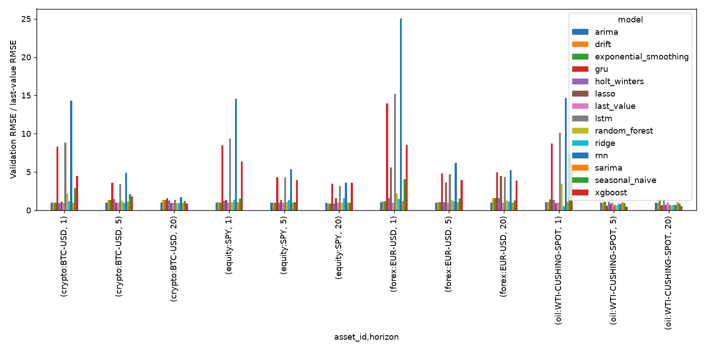
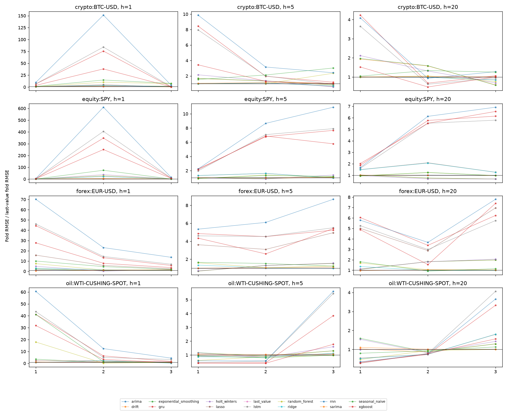

# MarketCast Lab: forecasting across four daily markets

## Abstract and question

How do statistical, lag-based machine-learning and recurrent neural models compare across crypto, equity, foreign exchange and crude oil, and how does that comparison change at 1, 5 and 20 observed-session horizons? Four immutable Phase 3 runs provide 672 fold and holdout metric rows. The audit reproduced 672 MAE/RMSE rows from saved predictions. Results are historical model evaluation, not investment advice.

## Concepts and target

**Trend** is sustained movement in the level; **seasonality** is a recurring pattern tied to a defensible period; **cycles** are broader, irregular swings; **noise** is movement unexplained by the fitted structure. **Stationarity** means the distributional properties used by a model do not change over time. Price levels often challenge this assumption, so the EDA tests levels and returns, while ARIMA uses first differencing. **Target** is the future observed price: adjusted close for SPY, close for BTC and the ECB/EIA point observations. **Horizon** is the next 1, 5 or 20 observed market dates. **Recursive strategy** means each later forecast step uses prior predictions, not newly observed outcomes.

## Sources, provenance and rights

| asset | provider | target | reuse | source_url |
| --- | --- | --- | --- | --- |
| crypto:BTC-USD | Bundled cryptocurrency statistics CSV; upstream provenance unknown | close | Unknown; do not redistribute beyond existing repository | unknown |
| equity:SPY | Yahoo Finance chart, SPDR S&P 500 ETF Trust | adjusted_close | Personal research only; raw redistribution unverified | https://query1.finance.yahoo.com/v8/finance/chart/SPY?period1=1672531200&period2=1798761600&interval=1d&events=history&includeAdjustedClose=true |
| forex:EUR-USD | ECB euro foreign exchange reference rate | close | Free reuse with ECB citation and transformation disclosure | https://data-api.ecb.europa.eu/service/data/EXR/D.USD.EUR.SP00.A?startPeriod=2023-01-01&endPeriod=2026-12-31&format=csvdata |
| oil:WTI-CUSHING-SPOT | EIA Cushing, OK WTI spot price FOB | close | EIA government data is public domain; redistribution permitted with attribution | https://www.eia.gov/dnav/pet/hist_xls/RWTCd.xls |

Every run manifest records the source URL or the known gap, raw SHA-256, retrieval time basis, symbol mapping, currency, timezone, adjustment, target semantics and calendar. SPY raw data is retained only in the ignored local cache. The bundled BTC upstream source and original acquisition time are unknown. WTI is an EIA Cushing spot assessment, so futures rolling and roll jumps do not apply.

## Cleaning and quality

| asset | rows | first | last | duplicate keys | invalid OHLC | outlier flags |
| --- | --- | --- | --- | --- | --- | --- |
| crypto:BTC-USD | 3901 | 2015-02-09 | 2025-10-14 | 0 | 0 | 88 |
| equity:SPY | 698 | 2023-01-03 | 2025-10-14 | 0 | 0 | 1 |
| forex:EUR-USD | 712 | 2023-01-02 | 2025-10-14 | 0 | 0 | 0 |
| oil:WTI-CUSHING-SPOT | 693 | 2023-01-03 | 2025-10-14 | 0 | 0 | 0 |

Dates are sorted and duplicate asset/date keys rejected. Missing source prices are dropped, with no synthetic holiday or weekend records. ECB and EIA provide point prices, so their OHLC and volume fields are null. The quality JSON files also contain missing-value counts, observed-date gap distributions, weekday gaps that include holidays, a >10% close-return outlier flag, provenance and transformations. The BTC and SPY OHLC bars remain source values; SPY's model target uses its separate adjusted close.

## Exploratory analysis and transformation decision

| asset | ADF p | KPSS p | return std | period |
| --- | --- | --- | --- | --- |
| crypto:BTC-USD | 0.0246 | 0.01 | 0.01639 | 7 |
| equity:SPY | 0.9424 | 0.01 | 0.01423 | 5 |
| forex:EUR-USD | 0.5175 | 0.01 | 0.005502 | 5 |
| oil:WTI-CUSHING-SPOT | 0.02305 | 0.06394 | 0.0212 | 5 |

Each run has price/return plots, 20-observation rolling mean and volatility, exploratory decomposition, level/return ACF and PACF, ADF and KPSS results. Its `eda.md` states the asset-specific transformation decision. The weekly period is seven consecutive observations for BTC and a five-observation working-week proxy for the other series. Holiday gaps mean this proxy is exploratory. Forecasts are evaluated in price units. Scalers for lag regressors and sequence networks fit on each training fold only; evaluation never constructs features across assets.

## Validation design and models

| asset | first validation | last validation | holdout |
| --- | --- | --- | --- |
| crypto:BTC-USD | 2025-07-27 | 2025-09-24 | 2025-09-25 to 2025-10-14 |
| equity:SPY | 2025-06-23 | 2025-09-16 | 2025-09-17 to 2025-10-14 |
| forex:EUR-USD | 2025-06-25 | 2025-09-16 | 2025-09-17 to 2025-10-14 |
| oil:WTI-CUSHING-SPOT | 2025-06-20 | 2025-09-15 | 2025-09-16 to 2025-10-14 |

The shared contract uses the final 180 observations per asset through 2025-10-14, three expanding validation folds of 20 observations, then a locked 20-observation holdout. These dates differ because the markets have different observation calendars. Each model sees the same folds within an asset. The matrix contains last value, drift, seasonal naive, exponential smoothing, Holt-Winters, ARIMA, SARIMA, Ridge, Lasso, Random Forest, XGBoost, RNN, LSTM and GRU. All use horizons 1, 5 and 20.

Ridge/Lasso standardize training lag features inside a scikit-learn pipeline. Tree models use lag windows without scaling. The PyTorch RNN, LSTM and GRU each take a 10-observation univariate window, one recurrent layer and a linear output. LSTM uses gated memory and GRU a smaller gated state; the vanilla RNN has no gates. The saved configuration limits them to two training epochs and four hidden units. Early stopping is available but this run is a compute-bounded comparison, not a broad architecture search. Simple ARIMA/SARIMA orders are fixed; the holdout is never used for tuning.

## Metrics and results

MAE averages absolute errors, RMSE emphasizes larger errors, sMAPE scales by forecast and actual magnitude, and MASE compares to an in-sample naive difference. Mean and standard deviation use the three validation folds. Runtime is training plus inference time. AIC/BIC apply to fitted statistical models; residual ACF and Ljung-Box p-values are saved separately. Only ARIMA/SARIMA supply intervals, so other coverage cells are blank.

| asset_id | horizon | model | rmse_mean | rmse_std | fold_cv | final_test_rmse | last_value_holdout_rmse | holdout_vs_last_value_pct | fit_seconds_mean | inference_seconds_mean | run_id |
| --- | --- | --- | --- | --- | --- | --- | --- | --- | --- | --- | --- |
| crypto:BTC-USD | 1 | holt_winters | 574.9 | 525.7 | 0.9145 | 4323 | 4340 | -0.3888 | 0.07474 | 0.002049 | 20260928T054600014613Z-2646b062 |
| crypto:BTC-USD | 5 | last_value | 1437 | 928.8 | 0.6463 | 3065 | 3065 | 0 | 1.91e-05 | 7.767e-06 | 20260928T054600014613Z-2646b062 |
| crypto:BTC-USD | 20 | xgboost | 3552 | 750.4 | 0.2112 | 7606 | 6102 | 24.65 | 0.2308 | 0.01197 | 20260928T054600014613Z-2646b062 |
| equity:SPY | 1 | last_value | 3.108 | 2.866 | 0.9222 | 0.809 | 0.809 | 0 | 1.257e-05 | 7.467e-06 | 20260928T054602477182Z-e456fc7a |
| equity:SPY | 5 | last_value | 8.424 | 5.391 | 0.64 | 5.173 | 5.173 | 0 | 1.257e-05 | 7.467e-06 | 20260928T054602477182Z-e456fc7a |
| equity:SPY | 20 | last_value | 14.39 | 10.15 | 0.7058 | 8.161 | 8.161 | 0 | 1.257e-05 | 7.467e-06 | 20260928T054602477182Z-e456fc7a |
| forex:EUR-USD | 1 | last_value | 0.002233 | 0.001172 | 0.5247 | 0.003 | 0.003 | 0 | 9.9e-06 | 9.7e-06 | 20260928T054604900545Z-5e05e298 |
| forex:EUR-USD | 5 | last_value | 0.008163 | 0.003825 | 0.4686 | 0.003724 | 0.003724 | 0 | 9.9e-06 | 9.7e-06 | 20260928T054604900545Z-5e05e298 |
| forex:EUR-USD | 20 | last_value | 0.009249 | 0.003616 | 0.391 | 0.01312 | 0.01312 | 0 | 9.9e-06 | 9.7e-06 | 20260928T054604900545Z-5e05e298 |
| oil:WTI-CUSHING-SPOT | 1 | ridge | 0.1917 | 0.1194 | 0.6226 | 0.65 | 1.23 | -47.15 | 0.00264 | 0.01256 | 20260928T054607431058Z-28fa2e2c |
| oil:WTI-CUSHING-SPOT | 5 | xgboost | 1.68 | 1.485 | 0.884 | 1.305 | 0.7741 | 68.54 | 0.01121 | 0.01228 | 20260928T054607431058Z-28fa2e2c |
| oil:WTI-CUSHING-SPOT | 20 | xgboost | 1.969 | 0.4607 | 0.234 | 2.473 | 1.815 | 36.27 | 0.01121 | 0.01228 | 20260928T054607431058Z-28fa2e2c |

The recommendation rule is fixed before viewing the holdout: a non-baseline model must lower both validation mean RMSE and mean plus one fold standard deviation by at least 5% versus last value. The selected rows above are generated from `recommendations.csv`. This rule favors simple models when apparent gains are small relative to fold variation. The `holdout_vs_last_value_pct` column exposes validation gains that reverse on the final period, particularly longer BTC and WTI forecasts.

## Residuals, uncertainty and complexity

| asset_id | model | ljung_box_pvalue_mean | parameter_count |
| --- | --- | --- | --- |
| crypto:BTC-USD | holt_winters | 0.006187 | — |
| crypto:BTC-USD | last_value | 9.98e-05 | — |
| crypto:BTC-USD | ridge | 0.0002895 | — |
| crypto:BTC-USD | xgboost | 5.783e-05 | — |
| equity:SPY | holt_winters | 0.09361 | — |
| equity:SPY | last_value | 0.07236 | — |
| equity:SPY | ridge | 0.08863 | — |
| equity:SPY | xgboost | 0.07606 | — |
| forex:EUR-USD | holt_winters | 0.03489 | — |
| forex:EUR-USD | last_value | 0.01999 | — |
| forex:EUR-USD | ridge | 0.02698 | — |
| forex:EUR-USD | xgboost | 0.005109 | — |
| oil:WTI-CUSHING-SPOT | holt_winters | 0.3176 | — |
| oil:WTI-CUSHING-SPOT | last_value | 0.1951 | — |
| oil:WTI-CUSHING-SPOT | ridge | 0.02214 | — |
| oil:WTI-CUSHING-SPOT | xgboost | 0.06729 | — |

ARIMA/SARIMA interval coverage is available for 24 asset/model/horizon combinations in `comparison.csv`; coverage is measured on short fold windows and should not be read as calibrated long-run uncertainty.

| asset_id | horizon | model | interval_coverage_mean | final_test_interval_coverage |
| --- | --- | --- | --- | --- |
| crypto:BTC-USD | 1 | arima | 1 | 0 |
| crypto:BTC-USD | 1 | sarima | 1 | 0 |
| crypto:BTC-USD | 5 | arima | 1 | 0.8 |
| crypto:BTC-USD | 5 | sarima | 1 | 0.8 |
| crypto:BTC-USD | 20 | arima | 1 | 0.95 |
| crypto:BTC-USD | 20 | sarima | 1 | 0.95 |
| equity:SPY | 1 | arima | 1 | 1 |
| equity:SPY | 1 | sarima | 1 | 1 |
| equity:SPY | 5 | arima | 1 | 1 |
| equity:SPY | 5 | sarima | 1 | 1 |
| equity:SPY | 20 | arima | 1 | 1 |
| equity:SPY | 20 | sarima | 1 | 1 |
| forex:EUR-USD | 1 | arima | 1 | 1 |
| forex:EUR-USD | 1 | sarima | 1 | 1 |
| forex:EUR-USD | 5 | arima | 1 | 1 |
| forex:EUR-USD | 5 | sarima | 1 | 1 |
| forex:EUR-USD | 20 | arima | 1 | 1 |
| forex:EUR-USD | 20 | sarima | 1 | 1 |
| oil:WTI-CUSHING-SPOT | 1 | arima | 1 | 1 |
| oil:WTI-CUSHING-SPOT | 1 | sarima | 1 | 1 |
| oil:WTI-CUSHING-SPOT | 5 | arima | 0.7333 | 1 |
| oil:WTI-CUSHING-SPOT | 5 | sarima | 0.7333 | 1 |
| oil:WTI-CUSHING-SPOT | 20 | arima | 0.8833 | 1 |
| oil:WTI-CUSHING-SPOT | 20 | sarima | 0.8833 | 1 |

Runtime in the selected-model table and network parameter counts in saved diagnostics show the extra compute required by complex methods. There were 0 recorded model failures. Warnings retained in the runs include:

| asset | warning |
| --- | --- |
| forex:EUR-USD | ConvergenceWarning: Maximum Likelihood optimization failed to converge. Check mle_retvals |

## Interpretation, limitations and threats to validity

There is no stable universal winner. For SPY and EUR/USD, the last-value forecast survives the improvement and variability threshold across horizons. Oil's validation folds support Ridge at one observation and XGBoost at longer horizons, but the longer-horizon holdout weakens that conclusion. BTC's 20-observation XGBoost selection similarly loses to last value on the holdout. Fold variability and one short locked test window limit ranking confidence.

The source data have different calendars, publication mechanisms and adjustment methods; raw RMSE cannot be compared across their price scales. The ECB reference fixing is not a continuous FX close. Yahoo adjustments can be revised. Spot oil has no roll discontinuity, but spot assessments can be revised or unavailable. Non-stationarity and regime changes threaten any fitted relationship. The experiment does not test transaction costs, trading rules, probabilistic calibration beyond statistical intervals or broader asset coverage. The BTC source license and SPY redistribution status constrain publication of underlying data.

## Reproducibility and conclusion

The report uses the four run IDs in `../phase3/run_index.json`. Each metric row in `../phase3/fold_metrics.csv` names its run ID, config, data manifest and prediction file. Regenerate with `python main.py four-markets --config configs/four_asset_full.json`, audit with `python main.py audit-four-markets`, and rebuild this report with `python main.py build-deliverables`. The dashboard reads the same runs. The evidence supports asset- and horizon-specific model choices with explicit holdout caveats, not a trading recommendation.
